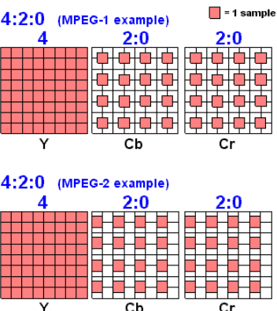

```rust
Today i will be building tiny real decoder. 
MiniCodec : 8-bit grayscale 
Frametype: I-Frames(intra) + P-frames(delta/motion)
Entropy will be simple bit level codes 

```

```rust

```

video decoding involves billions of repetitive mathematical calculations(multiplying & adding). division should be avoided to reduce computation
writing the core of these calculators in assembly allws us to create highly optimized code that runs much faster than what a typical high level language could achieve. we gain direct control over the hardware

Registers: super fast memory. operations are done in registers for faster computation.
----------------------------------------------------------------------------------------------------------------------------------------------
Memory: This is RAM, it is slower than Registers, but much larger. This is where our video file. decoded frames and program itself are stored.|
---------------------------------------------------------------------------------------------------------------     --------------------------

Instruction Set: This is the list of simple, basic operations the cpu knows how to do. Mov, ADD , JMP.

MOV R1, 10 (move number 10 to R1)
MOV R2, 5 (Move number 5 into R2)
ADD R1, R2 (add R2 & R1 and store the result to R1)
SUB R1, 3 (Subtract the number 3 from R1, storing result in R1)

video frame isn't one number, its a huge block of data, hundred of thousand of pixels.

That brings us to 2 key concepts for handling large data blocks in assembly: memory addressing and pointers.
for reliable manage garna ko lagi. kinaki resource is limited and have to do heavy thing.

memory addressing:
since registers are tiny, the actual video data lives in RAM. when we want to access a pixel data, we need it's address. its specific location in memory.
in high level code, you might write Pixel_Array[10]
----
----
----
----
baseko xa ram ma. 
whenever we want to acess that particular pixel, we use Pixel_Array[x]
-----------------------------------------------------------------------------------------------------
In Assembly, we have to manually calculate where that 10th pixel is located using addressing modes.

Pointers are key: we will use a register (R1) so that address can be stored instead of number.
----------------------------------------------------------------------------------------------------
IMPORTNAT FOR DECODER? IDCT(inverse Discrete Cosine Transform), works on 8x8 blocks of pixels[macroblocks].

jaba pani data read/write garnu parne hunxa, tetibela we have to jump tyo block of memory ko start ma jump huna saknu paryo.

further explanatoin with example of memory address and pixel that it holds:
address     Data
1000h       45
1001h       88


1004h       FO
---------------------
we have register R_ADDR jaslai as a pointer use garne xau.

suruma , that register lai hamile base address point garxau.
which is: MOV R_ADDR, 1000h

hamilai FO pixel value lai point garnu paryo re.

MOV R_DATA, [R_ADDR + offset] ; offset: how much do you have to add to that register so that you can reach that block of memory.
which is 4 hamro case ma: why? 1000h + 4 = 1004h which is the memory address pointed to the FO pixel

2.2 Introduction to SIMD instructions:
so, hamile access garna ta sikeu, aba calculations fast garna ko lagi kasari garne vanne kura auxa.
Tesko lagi nai SIMD baeko ho. 
SIMD : single instruction, multiple Data.

in morden cpu, we have multiple cpus right. so teslai use garna ko lagi we need parallel thing.

1. standard assmbly chai: single cpu ko lagi baneko ho. menaing: one instruction at a time .
        - command 1. command2 , commmand 3 and so on. that;s how you give the instruction evertime.

2. SIMD Assembly: super-wide, parallel CPU vako hunxa. we give only one instruction and all those instruction happen at onece in parallel.

yo kina important vayo ta?
decoders :-> block of data sanga operate gareko hunxa.
so, lookup reduce garna ko lagi, one block of address should hold more data right?
tesaile ta lookup thorai hune ho. pixel read/write ko bela ma.

modern cpu ko lagi. morden assembly instructions= xan like SSE or AVX instruction set.
1. Load 4,6,8 or even 16 pixel values into one wide SIMD register.
2. Perform the same math operation on all those values simmultaneiously with a single instruction.

aba you have parallel CPU which works parallely in response to the instruction set you have used. 
tesilae garda memory block ra parallel computaitonals haru hunxa.
which is the most expensive part of decoding.

standard assembly:
MUL use garyo vane 1 multiplication one unit time.
SIMD (wide register): 8 numbers multiplcation at one unit time.

so if we have to mulitply 32 different numbers by a constant value.

MUL R, constant value.
*32 times garda 32 times nai lagne vayo.

tara,

SIMD 
LOAD R, 8 ota number halinxa.
MUL R, contant vlaue

VMOVAPS YMM0, [RAX + 4*RCX] //load 8 elements from array a[i] to a[i+7] into YMM0
VMOVAPS YMM1, [RBX + 4*RCX] //load 8 elements from array b[i] to b[i+7] into YMM1

VMULPS YMM2, YMM0, YMM1

VMOVAPS [RDX + 4*RCX], YMM2 //so store the 8 results back to array c.

##3.1 Video Decoding Prerequistie: The Core MATH.

compression involves: Discrete Cosine Transform(DCT) and it's inverse , the inverse Discrete Cosine Transform(IDCT)

why need DCT/IDCT?

video and image compression standards(JPEG, MPEG-4, H.264) iniharu le color values store gardainan.
Instead, uniharu le transform the pixel data from the spatial domain(color,edges) haru bata frequency domain ma.

## DCT 
Discrete Cosine Transform
(compression Side): Takes 8x8 blocks of pixels and converts it into a set of 64 coeffiecents. video ko visible details haru first few coeffiecents(low frequencies) mai store garinxa, jabaki baki can be thrown away with the viewer noticing much. this is how we save space right! :).
[more knowledge gathered: *[JUMP](#mathematical-tool) ]

## IDCT 
the inverse Discrete Cosine Transform
(Decoding side): The decoder recieves the compressed coefficients (agi generated vako lower frequencies jun vaneko thiayu teslai liyera)
 and must use the inverse discrete cosine transform(IDCT) [transformer use garera]
to convert them back into the original 8x8 block of pixel values.

IDCT is taking those important coeffienct and recreating the video.

This step is repeated mittions of times per second, making it the perfect target for your high-speed assembly & SIMD code.

## mathematical-tool
so Fourier transform(FT) mathematical tool. frequency refers to how the pixel value is changing from one pixel to another.
array of frequencies conversion outputs.

## COMPRESSED 
this refers to video files are converted to from the spatial domain to the frequency domain

## Decompressed
IDCT uses those frequency domain coefficients into the visible pixel data or to spatial domain again.

## 4.1 - Video Decoding step 1: Data Representation:
brain : sees video: RGB 
tara video standards use: different color space for compression:: YCbCr(sometimes YUV or YIQ).

Y, Cb and Cr: seperating Brightness and color
1. Y (Luminance): This is the brightness or grayscale information. your eye is most sensitive to changes in the brightness.
2. Cb (Blue-Difference Chroma): This holds the blue color difference information.
3. Cr (red-Difference Chroma): This holds the red color difference information.

Why do decoders use YCbCr?
    Human eye is less sensitive to color detail (Cb/Cr) 
    tara dherai sensitive xa brightness detail (Luminance: Y) ma.

    Video compression takes advantage of this by storing less Cb and Cr data than Y
            meaning Y ko data dherai rakhxa comparsion to Cb and Cr.
    
                    For example: 4:2:0 for 4 Y values, decoder only receives  
                                 4 ota Y ko lagi
                                    2:(1 Cb , 1 Cr) - matra use hunxa    
                                     0 - second row ko lagi first row kai data use gariyeko indicate garxa.
                                This is how the lot of color data is thrown away.

## MacroBlocks: The building Blocks:
----(fundamental unit of work for assembly decoder)----decoder process one macroblocks at a time --

The entire Video frame isn't processed all at once. 24fps- 1 sec.
each frame pani ekkai choti process garidaina.
tyo frame lai breakdown garera -> managable chunks ma break garinxa = Macroblocks.

16x16 area of Y data, along with Cb and Cr data.
## IDCT-MACROBLOCKS
[IDCT](#IDCT) apply garda 16x16 pixels macroblocks ma, 8x8 sub-sections ma apply garinxa.
                    meaning scan garne power IDCT ma : 8x8 at a time.

IDCT lai chroma subsampling diyo vane like (4:2:0) usle tyo ratio ma Y, Cb ra Cr ko extraction hunxa frequencies bata.

## Assembly-for-IDCT-MACROBLOCKS


## 5.1 The simplified Video Decoding Pipeline

### Entropy Decoding (The file reader)
 what it is: compressed data in a file is usually encoded using efficient method like huffman coding or arithmetic coding. these methods use fewer bits for common data values.


 The Job: entropy decoder reads the stream and converts those compressed, variable-length codes back into the original frequency coefficients and other control information.

### Quantization
    spatial to frquency conversion garera higher frequencies coefficients(less imp to human eye) are rounded off which is the process of quantization. 

### Dequantization (Scaling the Data)
    What it is : During compression, many coefficients were rounded off (quantized) to save space, Dequantization is the reverse- it multiplies the received coefficients by a scaling factor.
    
    The Job: This restores the coefficients to values closer to their original form, preparing them for the IDCT.

### Motion Compensation
    what it is: this is the most complex part of video compression. to save space, many video frammes don't store a full new picture,

    example :  "This 16 X 16 block in the current frame is just the same block from the previous frame, but moved 5 pixels left and 3 pixels down."

    The job: decoder takes the pixel data from a previously decoded frame, (tei nai block ho vane , recompute nagarne rahixa. just tei pixel reuse)
                         uses the motion vectors to copy/move those blocks, ---into correct frame (tara copy and move chai garne rahixa pixels data lai)
                         then adds the newly decoded IDCT-processed residual data to form the final image.
#### motion compensation Problem & solution

 reference frame chahiyo so that next frame can be made on the basis of previous frame. and
motion vectors moves those pixels from reference frames.

solution : assembly allows you to use specific instructions for highly efficient memory copying and data shuffling between memory and registers, ensuring the data moces as quickly as the CPU can handle it.

### 6.1 Assembly challenge : why IDCT is the target.

IDCT involves a fixed set of multiplications & additions on a constant 8x8 matix. For a typical HD video running at 30 FPS.
Our decoder performs this calculation on tens of milltions of 8x8 block every second.

solution : This massive number of repetitive operations makes the IDCT algorithm the biggest bottleneck in the decoding process. By implementing it in highlt optimized Assembly using SIMD instructions we can active speed gains that are impossible in higher-level code.

