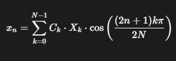

Topic: Mathematics of 1D IDCT:
The 2D IDCT, which transforms a block of frequency coefficients back to spatial pixel(before displaying) is usually done as 2 sequential 1D IDCTs.
1. one on the rows.
2. one on the columns.

we will start with 1D IDCT formula to understand what operations your SIMD code need to perform.
The 1D IDCT formula:

formula converts the frequency X.k to the spatial samples X.n:



N = size of block (8 for JPEG/MPEG)
n = spatial index (0 to N-1)
k = frequency index (0 to N-1)
X.k = input frequency coefficients(values from compressed file)
x.n = output pixel values
C.k= scaling factor ( a contant, 1/root_under(N) for k=0 and root_under(2/N) for k>0)

What this means for SIMD:
In a 8x8 block, the output pixel x.n is the result of a sum og 8 multiplications and 8 additions between the input coefficients X.k and a set of cosine constants.

The primary work for our SIMD code will be Speeding up these repeated multiplications and additions across all rows and columns.

aba euta single pixel x.n ko lagi, we have to multiply an input coefficient(frquency) X.k by a constant cos()
even though the inputs frequency coefficients are 8-bit, the multiplications of an 8-bit coefficient by a constant(scaled value) which is C.k * X.k
=results in number larget than 255.
To prevent overflow, the IDCT math is carried out using <b> 16-bit</b> signed integers. This keeps the intermediate results safe and accurate.

1. <b>_mm_mullo_epi16</b> = 16-bit multiplications.
2. <b> _mm_add_epi16</b> = dot product in parallel (addition of those multiplied values)

#### Data alignment (where speed depends)
Data is considered aligned when its :: memory address is a multiple of its size ::or size of SIMD register it will be loaded into
 
 For SSE instructions, using 128-bit registers(__m128 or __m128i) required alignment is usually 16bytes:

 - Aligned Address Example: An array starting at memory address 0x1000 is aligned because 1000 is a multiple of 16.
 - Unaligned Address Example: An array starting at memory address 0x1004 is not aligned because 1004 is not perfectly divisible by 16.
                            [for which the CPU has to the extra work, like multiple memory accesses and shuffling] to get it on the truck.

_mm_load_ps - must be 16-byte aligned: Faster (ideal choice for video processing kernels)
_mm_loadu_ps = no alignment required(can be any address) : slower(can be multiple assembly instructions) Used for remainder processing or when alignment cannot be guareented.

## While coding how we force to use aligned address?
there are functions like _mm_malloc or std::align to force our video data arrays to start at one of these aligned address.

```cpp
#include <malloc.h>//<mm_malloc.h> for some compilers like intel/GCC
void* aligned_ptr = _mm_malloc(size_t size, size_t alignment);

_mm_free(aligned_ptr);//MUST be freed with _mm_free

```cpp
// using std::align function
#include <memory>
size_t buffer_size = 1000;
void* buffer = std::malloc(buffer_size);

size_t alignment = 64;//desired alignment
size_t object_size = 128;//size of the object to place
void* current_ptr = buffer;//buffer pointer will be modified
size_t available_space = buffer_size;//remainig space will be modified
// calling std::align
void* aligned_ptr = std::align(alignment, object_size, current_ptr, available_space);

if(aligned_ptr){
    //aligned_ptr points to aligned address.
    //current_ptr will be moved past the padding and object space.
    //available_space is reduced
}

std::free(buffer);